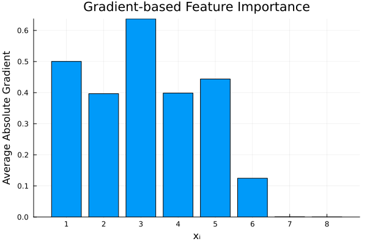
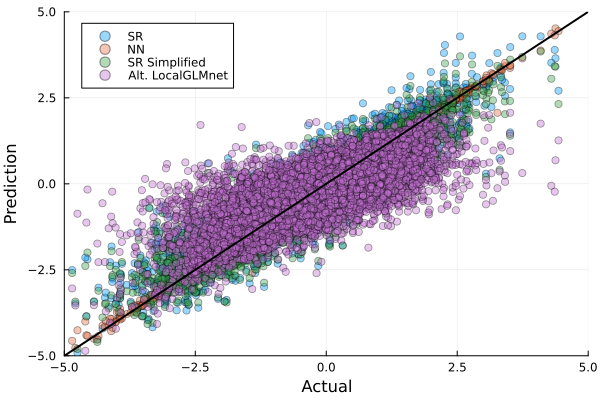

# Interpreting Neural Networks using LocalGLMnet

This is a WIP implementation of some of the work found in Richman &amp; Wüthrich ([2021](https://arxiv.org/pdf/2107.11059.pdf)), using Julia's Flux.jl + CUDA.jl.

While this does not aim to fully replicate the results of the paper, it follows some of its principles and shows some methodology for interpreting neural nets.

## Data

The data is synthesised using the following equation, taken from Richman et al.:

$$f(\mathbf{x}) = \frac{1}{2}x_1 - \frac{1}{4}x_2^2 + \frac{1}{2}|x_3|\sin(2x_3) + \frac{1}{2}x_4 x_5 + \frac{1}{8}x_{5}^2x_{6}$$

As an input, we create a 100 000 x 8 matrix of independent observations from a standard normal distribution, with the cavaet that features $x_2$ and $x_8$ have a 50% correlation.

The benefit of testing out a synthetic problem is that we have a reference point to validate against. The above function is also not 'trivial' like solving $f(x) = 2 + 4x$, and has the interesting catch that not all of the input features actually influence the final result.

## Approach

We train a feed-forward neural network to approximate the above equation. 75% of the data is used for training and the remainder for validation (all from the same sample). Once fitted, we test it on a further 100 000 observations, generated by taking new samples.

We then construct naive partial dependence plots by isolating the effect a single feature $x_i$ has on the output by passing only feature $x_i$ through the NN -- zeros everywhere else. This gives us a rough approximation for the impact changes in feature $x_i$ will have on the output.

Per Richman et al., we investigate the gradients by taking a Jacobian over a set of observations. The gradients are compared to the gradients of the true function and plotted to analyse their movements wrt changes in input. The average absolute value of each feature can be used to give us a rough feature importance plot.

Following this, we construct a LocalGLMnet model by taking the dot product of the gradient and the feature and summing this over the whole feature set, plus any bias term. 

As an alternative, we make a different form of a LocalGLMnet by instead summing the outputs from the isolated outputs to form an additive decomposition of the NN -- including any bias term.

Finally, we find an analytical approximation for the NN using `SymbolicRegression.jl` and compare it to the original function.

## Results
**_An HTML of the full investigation is available here: https://patrickm663.github.io/localglmnet.jl/_**.

When trained over 7 500 epochs, the model seemed to avoid overfitting by maintaining high accuracy in the validation set:

The MSE is as follows:

- **Train**: 0.000424
- **Valid**: 0.000727
- **Test**: 0.000849

The actual v predicted plot over the Test set shows very good results across the entire range:

We take two approaches to better understand the NN:
- investigate output when isolating a particular feature and passing it through the NN -- all else set to zero
- find the Jacobian using some input data and investigate the gradients per feature

The results indicate the gradients are fairly similar to our true underlying model, and we can derive naive partial dependence plots to analyse the relative impact of a feature.

Below is the gradient of $x_1$ and the gradient multiplied by the feature.

As a rough measure of variable importance, we take the average absolute value of the features' gradient over a subset of data and plot the results. Larger values indicate a feature is (approximately) more impactful in the model's output:

Per Richman et al., we take the dot product of the gradient of the feature and the feature itself and sum over all features. We add any bias term to the model.

**_As of now, it is likely something is mispecified in my code since the approximation was not good. PRs are welcome and encouraged if you know the paper and can spot my mistake! -- the other results from the paper re the gradients all match visually :)_**

As an alternative, we sum the isolated feature outputs and any bias term. In the future, this could be made more robust by applying a weighting to the results and including interaction terms. Furthermore, analytic approximations for each of the terms could perhaps be derived -- the same applies to the gradients refered to earlier.

The MSE from the approach above is 0.3001.

Finally, we apply symbolic regression to the fitted neural network which led to the following approximation (a slight adjustment to round the coefficients to make them more manageable -- further details in the notebook):

$$g_{SR}(x) = \frac{1}{2}x_1 - \frac{1}{2}|x_2| + \frac{1}{2}|x_3|\sin(2x_3) +\frac{1}{2}x_4 x_5$$

The MSE of this approximation is 0.0837.

Altogether, the actual v. predicted for all models is:

## Environment

The above analysis uses Julia 1.10.0-beta2 and a Pluto.jl notebook, which can be found in `src/`.

## Acknowledgements

The full print of Richman et al. is available at: https://arxiv.org/pdf/2107.11059.pdf

## TODO

- [ ] Update visualisations to include biplots and interactive 3D graphs and/or gifs.
- [ ] Include a GLM benchmark
- [ ] Fix the code to fully replicate the LocalGLMnet architecture per the paper
